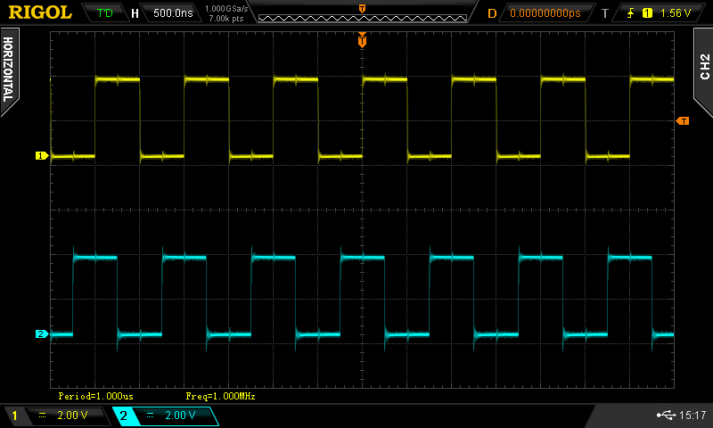

# Quadrature clock with RaspberryPI Pico PIO

An experiment to see how useful the RP2040 PIO is for generating quadrature clock signals.

## Why?

Usually quadrature clock signals are generated by a separate integrated circuit (e.g. SI5351).

I wanted to find out how feasible it is to generate them directly with the RP2040 microcontroller.

([skip to conclusion](#conclusion))

## What is a quadrature clock?

Whenever two otherwise identical waves have a phase difference of 90°, they are said to be *in quadrature*.

For example these two sine waves are in quadrature:


This program does not generate sine waves though: it generates square waves.

Quadrature clocks are a common ingredient of software defined radios (SDRs).

If you want to learn more, check out the [Wikipedia article about In-phase and quadrature components](https://en.wikipedia.org/wiki/In-phase_and_quadrature_components).

## Hardware setup

No external components needed (except an oscilloscope, to be able to see the waves).

Just connect an oscilloscope probe each to GPIO16 and GPIO17 (physical pins 21 and 22 on the rp-pico).

## Flashing / Running the program

This project is generated from the [rp2040-project-template](https://github.com/rp-rs/rp2040-project-template).
Check out [the instructions in their README](https://github.com/rp-rs/rp2040-project-template#running) on how to run it.

## How does it work

It uses a single programmable IO (PIO) unit of the RP2040 to generate the two clock signals on two output pins.

The output pins must be adjacent (i.e. have consecutive pin numbers).

This diagram shows a single cycle of the two signals:
```
                ________ 
               |        |
A              |        | ...
       ________|        |
            ________
           |        |
B          |        |     ...
       ____|        |____
       
AB      00  01  11   10   ...
```

Note how the combined signal consists of 4 different states: 00, 01, 11 and 10.

The PIO program simply goes through those 4 states as fast as possible:
```
.wrap_target
set pins, 0b00 [0]
set pins, 0b01 [0]
set pins, 0b11 [0]
set pins, 0b10 [0]
.wrap
```

Since the PIO runs these as fast as possible, the output frequency depends on the speed at which the PIO runs.
That speed is determined by two things:
- system clock frequency (aka `sys_clk`; 125MHz on the rp-pico, but may vary on other uCs)
- the clock divider for the PIO, which can be set from anything between `1` and `2^16`.

Since the program consists of 4 instructions which make up the full wave, the maximum attainable output frequency is `sys_clk / 4`.

See the comments where the the `int` and `frac` variables are set within [`src/main.rs`](./src/main.rs) for examples on how to set the dividers.

By default things are set up to output a 1 MHz wave.

## How well does it work?

Let's take a look at some traces:

- **1 MHz**
  
* **2 MHz**
  
* **31.25 MHz** (maximum)
  
* **476.84 Hz** (minimum)
  

So far so good.

Trying to get a 7 MHz or 14 MHz clock starts to show some noticible jitter though:

* **"7 MHz"**
  
* **"14 MHz"**
  

## Conclusion

So, how useful is this?

For low frequencies, or if the frequency of interest happens to be an integer divider of `sys_clk / 4`: it works reasonably well!

For use in a shortwave radio? Not so much :)

Accuracy is terrible, since the frequency can be set only in increments of 476.84Hz.

This could be remedied by delaying each instruction in the PIO program by 1 cycle: this halves the increment step, at the expense of halving the maximum frequency as well. This process can be repeated, though not forever: e.g. using a delay of 3 cycles brings the maximum frequency down to 7.8125MHz (comfortably within the 40m shortwave band), however the accuracy still is only ~120Hz, which is way too coarse for 200Hz channel spacing.
